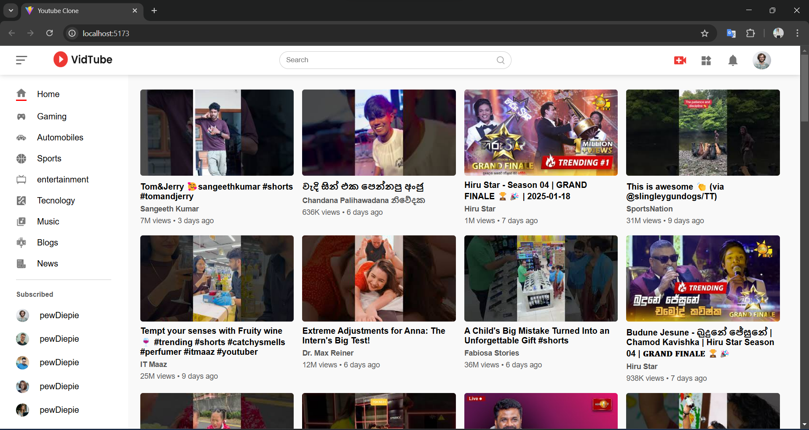
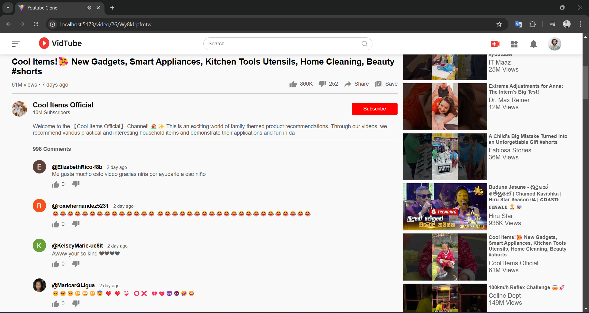

# YouTube Clone
A responsive YouTube clone application built with React, showcasing features such as video display, navigation, and responsive design. This project is part of a practice to improve React skills and implement real-world design patterns.

## 🛠Features
- **Responsive Design**: Optimized for various screen sizes using CSS and media queries.
- **Component-based Architecture**: Modularized React components for scalability and maintainability.
- **Styled with CSS**: Clean and modern UI using CSS styling.
- **Basic Video Information**: Display video thumbnails and metadata.

## Tech Stack

- **React**: Frontend library for building the UI.
- **CSS**: Styling and responsive design.
- **JavaScript (ES6)**: Logic and component development.
- **Node.js**: Runtime environment for development.
- **Visual Studio Code**: IDE used for development.

## Folder Structure
src
├── assets           # Images and static assets
├── Components       # React components
│   ├── Feed         # Video feed components
│   ├── Navbar       # Top navigation bar components
│   ├── PlayVideo    # Video player components
│   ├── Recommended  # Recommended video components
│   └── Sidebar      # Sidebar components
├── Pages            # Main pages of the app
│   ├── Home         # Home page
│   └── Video        # Video details page
├── App.css          # Global styles
├── App.jsx          # Main app component
└── index.js         # Entry point

## Screenshots

## License
This project is licensed under the MIT License. See the LICENSE file for details.

